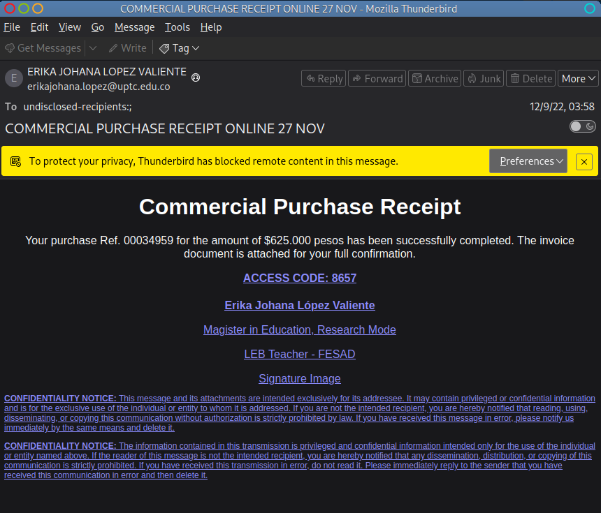
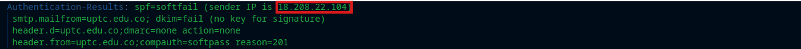
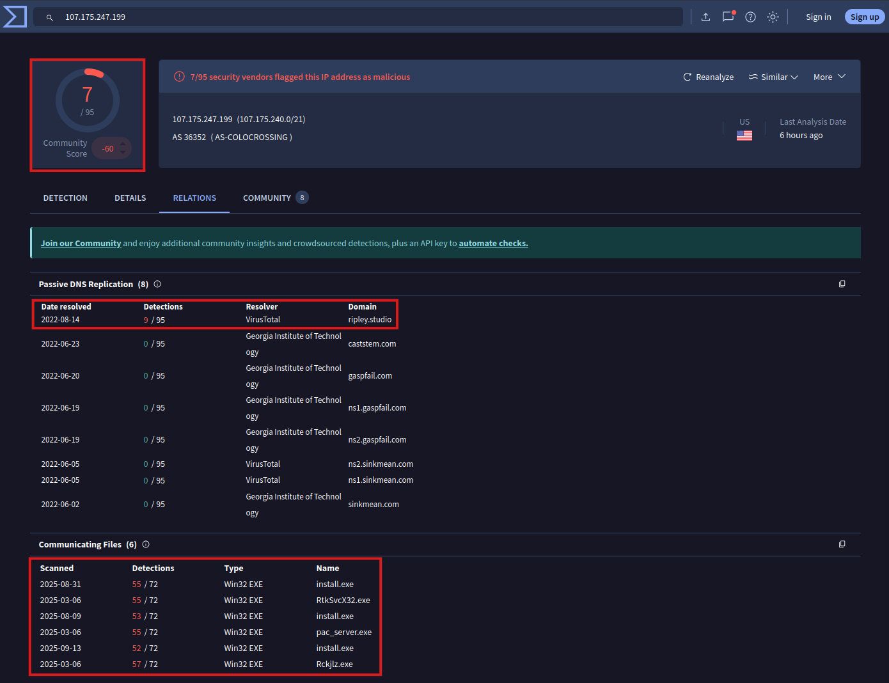
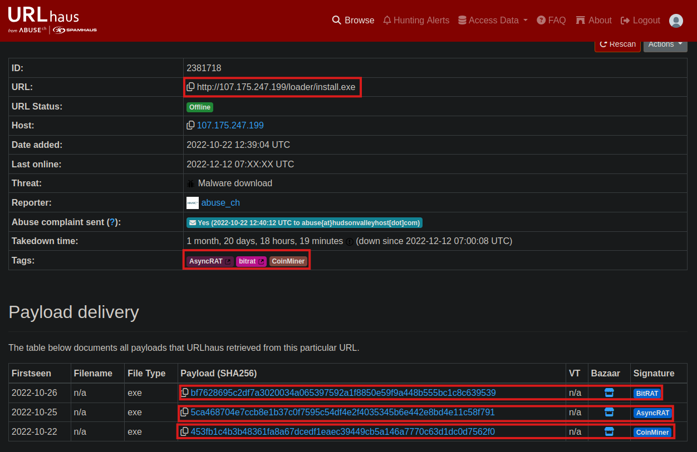
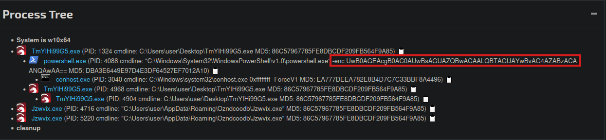
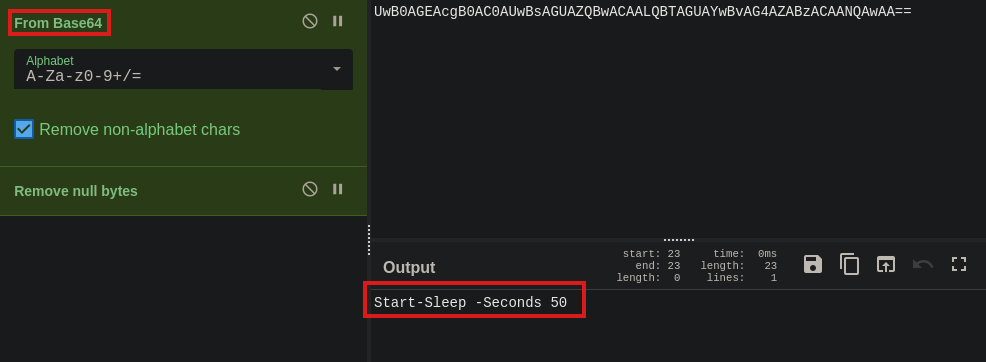

# 🐟 Rapport d'Incident - PhishStrike

> 💡 Analyse d'une campagne de phishing multi-malware ciblant une institution éducative (*Universidad Pedagógica y Tecnológica de Colombia*).  



---

## 1. 📌 Résumé Exécutif

### Contexte

Le 9 décembre 2022, une alerte de sécurité a signalé un e-mail de phishing ciblant des membres du corps professoral. L'attaquant a usurpé l'identité d'un contact académique légitime (`erikajohana.lopez@uptc.edu.co`) en exploitant l'absence de politique DMARC stricte.  

Le message prétendait signaler une transaction suspecte de $625,000 et contenait un lien vers un exécutable malveillant : `http://107.175.247.199/loader/install.exe`.  

  L'exécution du fichier permettrait :  
  - **BitRAT** : Accès distant complet, keylogging, persistence via registry  
  - **AsyncRAT** : Exfiltration de credentials via Telegram  
  - **CoinMiner** : Utilisation CPU/GPU pour minage de cryptomonnaie  


### Analyse de la Menace

**Échec des contrôles d'authentification** :  
  - SPF : softfail (IP `18.208.22.104` non autorisée)  
  - DKIM : fail (signature invalide)  
  - DMARC : none (absence de politique de rejet)  

Ces échecs combinés confirment que l'e-mail est spoofed et qu'il aurait dû être bloqué automatiquement par une politique DMARC appropriée.
> 💡 Avec une politique DMARC `p=reject`, ce message aurait été rejeté, car bien que le domaine du `From` soit identique au `Return-Path`, le SPF softfail et l’absence de DKIM invalident la confiance.  

**Infrastructure malveillante identifiée** :  
  - Hébergement : AS-COLOCROSSING (`107.175.247.199`)  
  - Distribution multi-malware : BitRAT, AsyncRAT, CoinMiner  
  - C2 : Domaine DDNS `gh9st.mywire.org`  
  - Exfiltration : Telegram Bot API (`bot5610920260`)  


### Sophistication de l'Attaque

  - **Multi-malware** : Trois familles sur une seule infrastructure  
  - **Évasion** : Sleep PowerShell 50s pour échapper aux sandboxes   
  - **Persistence** : Deux composants dans registry auto-run (`Jzwvix.exe` + payload)  
  - **Résilience C2** : DDNS permettant changement d'IP dynamique  
  - **Exfiltration furtive** : Service légitime (Telegram) difficile à bloquer  

### Actions Préventives Appliquées

  **Blocage immédiat** :  
  - IPs malveillantes (`107.175.247.199`, `18.208.22.104`)  
  - Domaine C2 (`gh9st.mywire.org`, `*.mywire.org`)  
  - URLs de distribution (`install.exe`, `server.exe`)  
  - Hashes des trois familles de malware  

  **Mesures de protection** :  
  - Mise en place d'une politique DMARC stricte (`p=reject`) afin de bloquer automatiquement les e-mails spoofed
  - Quarantaine des e-mails similaires  
  - Mise à jour signatures EDR/antivirus  
  - Scan préventif du parc informatique  
  - Surveillance renforcée activée (30 jours)  
  
**✅ Résultat** : Menace neutralisée avant exécution.  


### Conclusion

Cette attaque montre comment un simple e-mail d’apparence légitime peut contourner les protections lorsqu’aucune politique d’authentification stricte n’est appliquée.
L’absence de DMARC a permis à l’attaquant d’usurper une adresse académique réelle et de diffuser un lien malveillant vers plusieurs malwares.

> 💡 L’incident rappelle la nécessité de renforcer la sécurité des e-mails et de maintenir la vigilance des utilisateurs face aux campagnes de phishing ciblé.


---

## 2. 🔍 Analyse des Headers SMTP

### Trajet du Message

Le message suit un parcours atypique à travers plusieurs infrastructures :

```
Google (uptc.edu.co - 209.85.221.65)
  ↓
Trend Micro/AWS (18.208.22.104)
  ↓
Microsoft Exchange Online
  ↓
Google Workspace (fsfb.org.co)
```

**Observation** : La présence de multiples fournisseurs (Google, AWS, Microsoft) dans le flux d'envoi est inhabituelle pour une communication directe entre institutions éducatives et constitue un indicateur de message falsifié.

### Résultats d'Authentification

| Protocole | Résultat | IP Concernée | Analyse |
|-----------|----------|--------------|---------|
| **SPF** | softfail | `18.208.22.104` | Serveur non autorisé |
| **DKIM** | fail | `18.208.22.104` | Signature invalide/absente |
| **DMARC** | none | - | Aucune politique publiée |



**Conclusion** : L'échec combiné des trois mécanismes d'authentification confirme l'usurpation d'identité.  

### Return-Path

```
From: erikajohana.lopez@uptc.edu.co
Return-Path: erikajohana.lopez@uptc.edu.co
```

Bien que les champs soient alignés, cet alignement ne garantit pas l'authenticité en l'absence de signatures DKIM valides.


---

## 3. 🔍 Analyse du Corps du Message

### Contenu

Le message imite un reçu commercial avec les éléments suivants :
- **# Référence** : #00034959
- **Date** : 09/12/22
- **Montant** : $625,000 pesos
- **Code d'accès fourni** : 8657

### URL Malveillante

```
http://107.175.247.199/loader/install.exe
```

| Attribut | Valeur |
|----------|--------|
| Type | Exécutable Windows (.exe) |
| IP hébergement | `107.175.247.199` |
| ASN | AS-COLOCROSSING |
| Port | 80 (HTTP non sécurisé) |

### Techniques d'Ingénierie Sociale

1. **Urgence financière** - Montant élevé créant la panique
2. **Autorité usurpée** - Signature académique détaillée
3. **Légitimité apparente** - Clause de confidentialité légale
4. **Fausse sécurité** - Code d'accès fourni


---

## 4. 🔬 Analyse Statique

### Réputation de l'IP 107.175.247.199

**VirusTotal** : Détections multiples, association avec domaines spoofed (`ripley.studio`)



**URLhaus** : URL héberge trois familles de malware distinctes  




**ASN** : AS-COLOCROSSING (fréquemment associé à des activités malveillantes)  


### Familles de Malware Identifiées

#### 1. CoinMiner
- **SHA256** : `453fb1c4b3b48361fa8a67dcedf1eaec39449cb5a146a7770c63d1dc0d7562f0`
- **Fonction** : Cryptomining (Monero)
- **Impact** : Consommation CPU 80-100%, ralentissement système
- **URL requêtée** : `http://ripley.studio/loader/uploads/Qanjttrbv.jpeg`

#### 2. BitRAT
- **SHA256** : `bf7628695c2df7a3020034a065397592a1f8850e59f9a448b555bc1c8c639539`
- **Fonction** : Remote Access Trojan commercial
- **Capacités** : Keylogging, contrôle à distance, exfiltration fichiers
- **Persistence** : Registry Run Keys
  - Fichier 1 : `Jzwvix.exe` (loader)
  - Fichier 2 : Payload principal (hash ci-dessus)
- **C2** : `gh9st.mywire.org` (DDNS)

#### 3. AsyncRAT
- **SHA256** : `5ca468704e7ccb8e1b37c0f7595c54df4fe2f4035345b6e442e8bd4e11c58f791`
- **Fonction** : RAT open-source modifié
- **Exfiltration** : Telegram Bot API
- **Bot ID** : `bot5610920260`


---

## 5. 🔬 Analyse Dynamique (Sandbox)

### Chaîne d'Infection

```
1. Téléchargement : `http://107.175.247.199/loader/install.exe`
2. Exécution du loader
3. Requête HTTP : `http://107.175.247.199/loader/server.exe`
4. Installation BitRAT + persistence (`Jzwvix.exe`)
5. Connexion C2 : `gh9st.mywire.org`
6. Exfiltration via Telegram : `bot5610920260`
```

### Techniques d'Évasion

**PowerShell Sleep Command** :
- Délai : 50 secondes
- Objectif : Échapper aux sandboxes à timeout court
- Commande décodée : `Start-Sleep -Seconds 50`





### Persistence

**Clé de registre modifiée** :.
```
HKEY_CURRENT_USER\Software\Microsoft\Windows\CurrentVersion\Run
```

Deux fichiers ajoutés pour assurer la résilience :
1. `Jzwvix.exe` (loader de persistence)
2. Payload BitRAT principal


---

## 6. 🏷️ Indicateurs de Compromission (IoCs)

### Adresses E-mail
```
erikajohana.lopez@uptc.edu.co (usurpé)
```

### Adresses IP
```
18.208.22.104       (SPF softfail/DKIM fail - AWS)
107.175.247.199     (Hébergement malware - AS-COLOCROSSING)
209.85.221.65       (Serveur Google initial)
```

### Domaines & URLs
```
gh9st.mywire.org
http://107.175.247.199/loader/install.exe
http://107.175.247.199/loader/server.exe
http://ripley.studio/loader/uploads/Qanjttrbv.jpeg
```

### Hashes SHA256
```
bf7628695c2df7a3020034a065397592a1f8850e59f9a448b555bc1c8c639539  (BitRAT)
5ca468704e7ccb8e1b37c0f7595c54df4fe2f4035345b6e442e8bd4e11c58f791  (AsyncRAT)
453fb1c4b3b48361fa8a67dcedf1eaec39449cb5a146a7770c63d1dc0d7562f0  (CoinMiner)
```

### Artefacts de Persistence
```
Registry: HKCU\Software\Microsoft\Windows\CurrentVersion\Run
Fichiers: Jzwvix.exe, server.exe, install.exe
```

### Identifiants Externes
```
bot5610920260 (Telegram Bot ID)
```


---

## 7. 🧬 Mapping MITRE ATT&CK

| Tactic | Technique | ID | Détails |
|--------|-----------|-----|---------|
| Initial Access | Spearphishing Link | T1566.002 | Lien malveillant dans e-mail |
| Execution | User Execution | T1204.001 | Téléchargement et exécution par l'utilisateur |
| Execution | PowerShell | T1059.001 | Sleep 50s pour évasion |
| Persistence | Registry Run Keys | T1547.001 | Modification HKCU\Run |
| Defense Evasion | Virtualization/Sandbox Evasion | T1497.003 | Délai 50s |
| Defense Evasion | Obfuscated Files | T1027 | PowerShell base64, faux .jpeg |
| Credential Access | Input Capture | T1056.001 | Keylogging (BitRAT/AsyncRAT) |
| Discovery | System Information Discovery | T1082 | Collecte infos système |
| Collection | Data from Local System | T1005 | Exfiltration fichiers |
| Command and Control | Dynamic Resolution | T1568.002 | DDNS (mywire.org) |
| Command and Control | Web Service | T1102 | Telegram API abusée |
| Exfiltration | Exfiltration Over Web Service | T1567.002 | Telegram Bot |
| Impact | Resource Hijacking | T1496 | Cryptomining |


---

## 8. 🌐 Réponses aux Questions d'Investigation

### Question 1
**Quelle est l'adresse IP de l'expéditeur avec SPF softfail et DKIM fail ?**

**Réponse** : `18.208.22.104`

**Méthode** : Analyse des headers SMTP via PhishTool. Cette IP correspond au serveur Trend Micro hébergé sur AWS (AS14618 Amazon-AES) qui a relayé le message. Les résultats d'authentification montrent clairement SPF=softfail et DKIM=fail pour cette adresse.

---

### Question 2
**Quel est le Return-Path spécifié dans cet e-mail ?**

**Réponse** : `erikajohana.lopez@uptc.edu.co`

**Méthode** : Extraction directe du header Return-Path. Cette adresse, bien qu'alignée avec le champ From, est usurpée comme le confirment les échecs d'authentification SPF/DKIM.

---

### Question 3
**Quelle est l'adresse IP du serveur hébergeant le fichier malveillant ?**

**Réponse** : `107.175.247.199`

**Méthode** : Extraction de l'URL malveillante dans le corps du message (`http://107.175.247.199/loader/install.exe`). Vérification via URLhaus et VirusTotal confirme que cette IP héberge plusieurs familles de malware.

---

### Question 4
**Quelle famille de malware est responsable du minage de cryptomonnaie ?**

**Réponse** : `CoinMiner`

**Méthode** : Consultation de la base de données URLhaus pour l'URL `http://107.175.247.199/loader/install.exe`. URLhaus identifie trois familles hébergées sur cette infrastructure, dont CoinMiner spécifiquement associé au cryptomining.

---

### Question 5
**Basé sur l'analyse du malware de cryptomining, quelle URL est requêtée ?**

**Réponse** : `http://ripley.studio/loader/uploads/Qanjttrbv.jpeg`

**Méthode** : Analyse du hash SHA256 du malware CoinMiner (`453fb1c4b3b48361fa8a67dcedf1eaec39449cb5a146a7770c63d1dc0d7562f0`) sur VirusTotal. L'onglet Relations révèle les URLs contactées par ce malware, incluant cette ressource utilisée pour télécharger des composants additionnels ou configurations.

---

### Question 6
**Quel est le nom de l'exécutable dans la première valeur ajoutée à la clé de registre auto-run ?**

**Réponse** : `Jzwvix.exe`

**Méthode** : Analyse dynamique du malware BitRAT via Joe Sandbox et ANY.RUN. Observation des modifications de registre dans `HKEY_CURRENT_USER\Software\Microsoft\Windows\CurrentVersion\Run`. Le premier fichier ajouté est Jzwvix.exe, agissant comme loader de persistence.

---

### Question 7
**Quel est le hash SHA-256 du fichier téléchargé et ajouté aux clés autorun ?**

**Réponse** : `bf7628695c2df7a3020034a065397592a1f8850e59f9a448b555bc1c8c639539`

**Méthode** : Soumission de l'échantillon BitRAT à MalwareBazaar avec recherche du hash. Corrélation avec l'analyse sandbox (ANY.RUN/Joe Sandbox) confirmant qu'il s'agit du second fichier ajouté aux clés de registre auto-run, constituant le payload principal de BitRAT.

---

### Question 8
**Quelle est l'URL dans la requête HTTP utilisée par le loader pour récupérer BitRAT ?**

**Réponse** : `http://107.175.247.199/loader/server.exe`

**Méthode** : Analyse des requêtes HTTP dans ANY.RUN. Après l'exécution de `install.exe` (loader initial), observation d'une requête HTTP GET vers cette URL pour télécharger le payload BitRAT principal.

---

### Question 9
**Quel est le délai (en secondes) causé par la commande PowerShell ?**

**Réponse** : `50`

**Méthode** : Extraction du code PowerShell encodé en Base64 depuis l'analyse sandbox. Décodage via CyberChef révèle la commande `Start-Sleep -Seconds 50`, technique d'évasion pour échapper aux sandboxes à timeout court.

---

### Question 10
**Quel est le domaine C2 utilisé par BitRAT ?**

**Réponse** : `gh9st.mywire.org`

**Méthode** : Analyse des requêtes DNS dans ANY.RUN durant l'exécution de BitRAT. Le malware effectue des résolutions DNS vers ce domaine DDNS (Dynamic DNS) pour établir la communication avec le serveur Command & Control de l'attaquant.

---

### Question 11
**Quel est l'ID du Bot Telegram utilisé par AsyncRAT pour l'exfiltration ?**

**Réponse** : `bot5610920260`

**Méthode** : Analyse réseau détaillée de l'échantillon AsyncRAT via Tria.ge. La section Network du rapport révèle des connexions HTTPS POST vers `api.telegram.org` avec ce Bot ID spécifique utilisé pour exfiltrer les données volées via l'API Telegram.


---

## 9. 🧰 Outils Utilisés

| Catégorie | Outil | Usage |
|-----------|-------|-------|
| Email Analysis | PhishTool | Headers SMTP, authentification |
| Email Analysis | Thunderbird | Visualisation message |
| Threat Intel | URLhaus | Identification malware families |
| Threat Intel | MalwareBazaar | Recherche hashes |
| Threat Intel | VirusTotal | Réputation IP/URL/fichiers |
| Sandbox | Joe Sandbox | Analyse BitRAT |
| Sandbox | ANY.RUN | HTTP/DNS requests |
| Sandbox | Tria.ge | Network analysis AsyncRAT |
| Deobfuscation | CyberChef | Décodage PowerShell |
| Framework | MITRE ATT&CK | Mapping techniques |


---

## 10. 📊 Références

**Source du cas** : [CyberDefenders - PhishStrike Challenge](https://cyberdefenders.org/blueteam-ctf-challenges/phishstrike/)

**Documentation malware** :
- [Malpedia - BitRAT](https://malpedia.caad.fkie.fraunhofer.de/details/win.bitrat)
- [Malpedia - AsyncRAT](https://malpedia.caad.fkie.fraunhofer.de/details/win.asyncrat)
- [Malpedia - CoinMiner](https://malpedia.caad.fkie.fraunhofer.de/details/win.coinminer)

**Threat Intelligence** :
- URLhaus : [https://urlhaus.abuse.ch/](https://urlhaus.abuse.ch/)
- MalwareBazaar : [https://bazaar.abuse.ch/](https://bazaar.abuse.ch/)


---

> ⚠️ **Disclaimer :** Ce document est à but éducatif. Ne manipulez pas d’artefacts malveillants sur des machines non isolées. Toutes les actions actives (HEAD, expansion d’URL, exécution de pièces jointes) doivent être faites dans une VM/sandbox isolée.

*Dernière modification : 22 octobre 2025*


