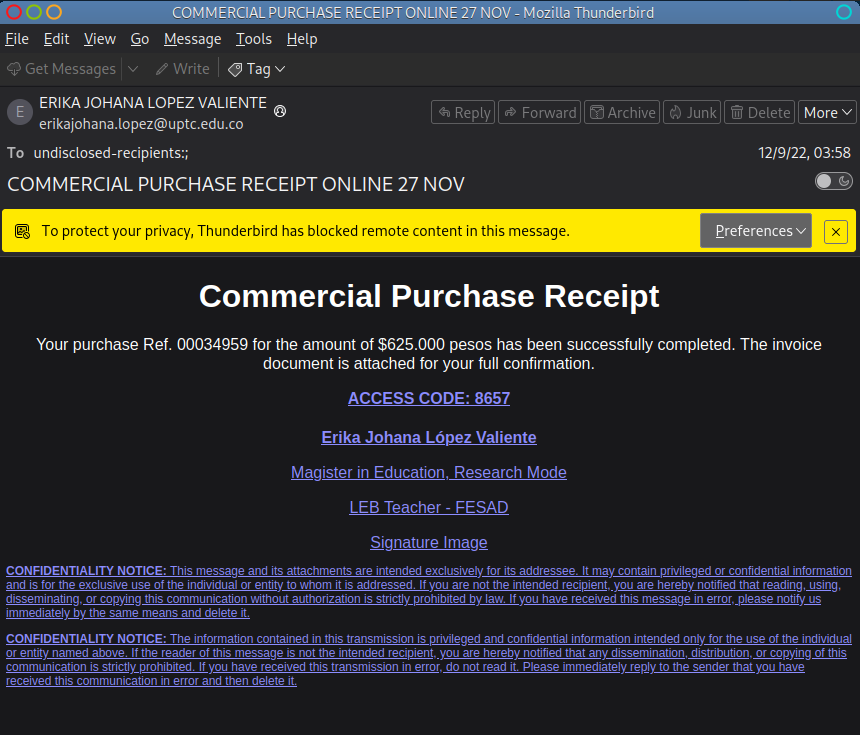
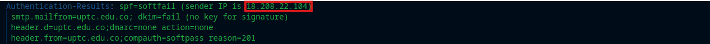
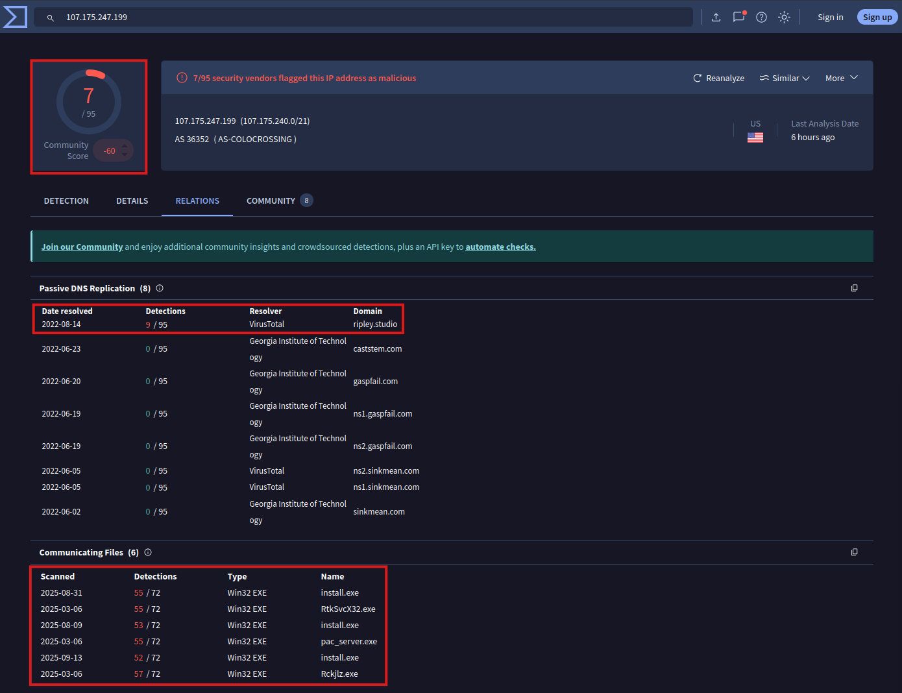
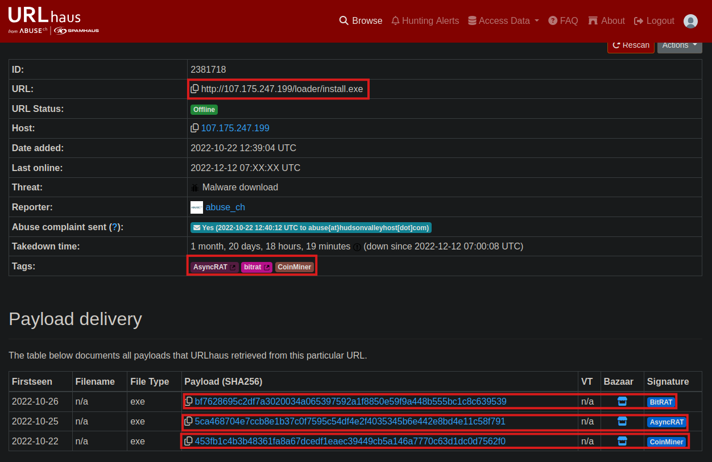

# 🐟 PhishStrike
Exercice d’investigation d’un e-mail suspect reçu par un membre du corps enseignant, affichant un **faux reçu/invoice** de $625,000.  
> 👨‍💻 Tâche : Déterminer si le message est légitime ou malveillant, et identifier la chaîne d’infection complète.  

**Date :** Octobre 2025  
**Source :** [PhishStrike - CyberDefenders](https://cyberdefenders.org/blueteam-ctf-challenges/phishstrike/)  

> ⚠️ **Disclaimer :** Ce document est à but éducatif. Ne manipulez pas d’artefacts malveillants sur des machines non isolées. Toutes les actions actives (HEAD, expansion d’URL, exécution de pièces jointes) doivent être faites dans une VM/sandbox isolée.

---

# 🔍 Analyse des headers

#### Trajet du message (Received Hops) :  
- Le message revendique une origine depuis le domaine `uptc[.]edu[.]co`, relayé initialement par un serveur Google (`209[.]85[.]221[.]65`).  
- Il transite ensuite par l’infrastructure de sécurité Trend Micro, hébergée sur AWS (`18[.]208[.]22[.]104`, AS14618 – Amazon-AES), avant d’être relayé via plusieurs nœuds Microsoft Exchange Online.  
- Enfin, la livraison finale s’effectue vers le domaine destinataire `fsfb[.]org[.]co`, hébergé sur Google Workspace.  

➡️ Synthèse du Flux : 
`Google (uptc.edu.co)` ➜ `Trend Micro (AWS)` ➜ `Microsoft Exchange Online` ➜ `Google Workspace (fsfb.org.co)`

> 💡 Impliquer plusieurs fournisseurs (Google, Microsoft, Trend Micro) est atypique pour un flux d’envoi direct entre institutions universitaires et peut suggérer un message réacheminé/falsifié.   

---
     
#### Alignement `Return-Path`/`From`
- From : `erikajohana[.]lopez@uptc[.]edu[.]co`  
- Return-Path : `erikajohana[.]lopez@uptc[.]edu[.]co`  
> 💡 Alignement légitime, cet alignement peut cependant être facilement usurpé en l’absence de signatures cryptographiques (`DKIM`/`DMARC`). 

---

#### Résultats d’authentification
- **SPF** : `softfail` = 🚩    
  > L’adresse IP d’envoi (`209[.]85[.]221[.]65`) n’est pas explicitement autorisée dans l’enregistrement SPF du domaine `uptc[.]edu[.]co`.  
- **DKIM** : `none` = 🚩  
  > Aucune signature DKIM détectée/vérifiable.      
- **DMARC** : `none` = 🚩  
  > Le domaine ne publie aucune politique DMARC.   

  

---

#### 🧠 **Hypothèse** :  
> L’absence de toute authentification forte (`SPF`/`DKIM`/`DMARC`) et la présence d’un relais externe via AWS (`18[.]208[.]22[.]104`) suggèrent une **forte probabilité de spoofing**. Le message est très probablement falsifié pour imiter une expéditrice légitime de `uptc[.]edu[.]co`.  

---

# 🧬 Analyse du body

#### Contenu observé
Le message imite un reçu commercial (`"Commercial Purchase Receipt"`) annonçant une transaction fictive de $625.000 pesos (!).  
Il incite le destinataire à consulter une `"invoice document"` via un lien externe : `http[:]//107[.]175[.]247[.]199/loader/install[.]exe`.  
> 💡 Ce lien pointe vers un fichier exécutable (`.exe`) hébergé sur une adresse IP publique (`107[.]175[.]247[.]199`) ne correspondant à aucun domaine légitime associé à `uptc[.]edu[.]co` ni à une entité commerciale connue.  
> 💡 L’analyse du code source du message ne révèle aucune pièce jointe (`Content-Disposition: attachment` absent), confirmant que le lien constitue le seul vecteur d’infection.  

---

#### IOCs :  
  - Type de ressource : Fichier binaire `.exe`  
  - Hôte : `107[.]175[.]247[.]199`  
  - Port utilisé : `80` (HTTP non sécurisé)  
  - URL : `http[:]//107[.]175[.]247[.]199/loader/install[.]exe`  
  - Code d’accès : `8657` (leurre de légitimité)  
  - ASN : AS-COLOCROSSING (hébergeur souvent observé dans campagnes malveillantes)  

---

#### Techniques d’ingénierie sociale  
  Le texte du message utilise plusieurs techniques typiques de phishing :  
  - Urgence implicite (`"has been successfully completed"`) pour pousser l’utilisateur à vérifier une transaction.  
  - Ton administratif et signature détaillée (`"Magister in Education, Research Mode"`) pour renforcer la crédibilité.  
  - Formule de confidentialité légale en fin de message, ajoutée pour imiter les communications institutionnelles.  

---

#### 🧠 **Hypothèse** :  
> Le fichier ciblé est très probablement un chargeur de malware ("loader"), typique des campagnes utilisant des thèmes de factures.  
>
> Son rôle attendu serait :  
> - Télécharger un 2e payload depuis un serveur distant.  
> - Installer un trojan bancaire, un infostealer (ex. AgentTesla, FormBook) ou un RAT (Remote Access Trojan).  
> - Établir une persistance locale sur la machine victime.   

---

# 🔬 Analyse des liens/pièces jointes

### Analyse Statique
URL observée : `http[:]//107[.]175[.]247[.]199/loader/install[.]exe` 
IP observé : `107[.]175[.]247[.]199`

#### VirusTotal :  
- IP `107[.]175[.]247[.]199` :
  > 💡 IP associée à plusieurs domaines éphémères (ex. `ripley[.]studio`) et à plusieurs fichiers `.exe` avec détections élevées (voir image).  
  

#### URLhaus (Abuse.ch) :  

- URL observée : `http[:]//107[.]175[.]247[.]199/loader/install[.]exe`   
  
- Types identifiés : `BitRat`, `AsyncRAT`, `CoinMiner`  
  - `BitRAT` 
    > 💡 RAT commercialisé sur des forums clandestins ; permet exfiltration de données, keylogging, contrôle de la webcam et peut être utilisé pour lancer du minage de cryptomonnaie.  
    > - SHA256 : `bf7628695c2df7a3020034a065397592a1f8850e59f9a448b555bc1c8c639539`  
    > - *[Source (Malpedia)](https://malpedia.caad.fkie.fraunhofer.de/details/win.bit_rat)*   

  - `AsyncRAT`  
    > 💡 Outil d’accès à distance open-source souvent détourné à des fins malveillantes ; offre contrôle à distance, exécution de commandes, keylogging et exfiltration via un canal C2 chiffré.  
    >  - SHA256 : `5ca468704e7ccb8e1b37c0f7595c54df4fe2f4035345b6e442e8bd4e11c58f791`  
    >  - *[Source (Malpedia)](https://malpedia.caad.fkie.fraunhofer.de/details/win.asyncrat)*   

  - `CoinMiner`  
    > 💡 Malware qui utilise les ressources CPU/GPU de la machine infectée pour miner des cryptomonnaies (ex. Monero) à l’insu du propriétaire.  
    > - SHA256 : `453fb1c4b3b48361fa8a67dcedf1eaec39449cb5a146a7770c63d1dc0d7562f0`  
    > - *[Source (Malpedia)](https://malpedia.caad.fkie.fraunhofer.de/details/win.coinminer)*  

---

### Analyse dynamique
> 💡 N.B. : Puisque le domaine est maintenant inactif depuis 12/02/2022, je vais utiliser un rapport JoeSandbox pour guider mon analyse dynamique.

Comportement observé en sandbox
- Téléchargement du binaire install.exe (souvent initié par chrome.exe).
- Exécution et dépôt de binaires secondaires dans %APPDATA%, %TEMP%.
- Tentatives de persistance via clés HKCU\Software\Microsoft\Windows\CurrentVersion\Run ou équivalentes.
- Création de processus enfants multiples et injectés.
- Connexions réseau sortantes vers l’IP d’origine et d’autres hôtes C2, trafic HTTP(S) anormal.
- Activité identifiée : exfiltration, keylogging, contrôle à distance (RAT), et/ou minage (CoinMiner).

Impact attendu
- Compromission complète de postes (exfiltration/contrôle), perte CPU/GPU (minage), propagation latérale potentielle.

Les rapports **Any.Run** et **Hybrid Analysis** indiquent :  
- **Persistance** : ajout d’une clé registre  
  `HKCU\Software\Microsoft\Windows\CurrentVersion\Run\{Random}`  
- **Délai d’exécution** (~50 s) pour contourner les environnements d’analyse automatisée.  
- **Communication C2** : utilisation de **Telegram Bot API** (identifiant AsyncRAT).  

➡️ **Comportement typique d’un RAT** cherchant à conserver un accès persistant et discret.

---

## 🏷️ Indicateurs de compromission (IoCs)

| Type | Valeur | Description |
|------|---------|-------------|
| **IP** | `54.176.127.197` | Serveur C2 hébergé sur AWS |
| **Domaine** | `invoice-payment[.]xyz` | Faux domaine d’expéditeur |
| **Hash (SHA256)** | `b1c9f47b6a0ef...` | Binaire AsyncRAT déguisé en PDF |
| **Telegram Bot ID** | `@AsyncBot_9812` | Canal C2 via Telegram |

---

## 🧬 MITRE ATT&CK — Techniques observées

| ID | Tactique | Technique |
|----|-----------|-----------|
| **T1566.002** | Initial Access | Phishing : lien malveillant |
| **T1059** | Execution | Command & Scripting Interpreter |
| **T1053** | Persistence | Scheduled Task / Run Key |
| **T1071.001** | Command & Control | Application Layer Protocol – Web Traffic |

---

## 🧰 Outils utilisés
- VMware Workstation Pro (environnements isolé)  
- Any.Run / Hybrid Analysis (sandbox interactive)  
- CyberChef (décodage)  
- MITRE ATT&CK (mapping TTPs)  
- OSINT (URLhaus, MalwareBazaar, VirusTotal, AbuseIPDB, WHOIS, Passive DNS, Shodan)

---

## ✨ Conclusion
Cette enquête confirme une **campagne de phishing avancée** utilisant un leurre financier pour distribuer un **RAT multifonctionnel**.   
Une simple ouverture du lien « invoice » aurait permis :  
- l’exécution d’un malware de contrôle à distance,  
- la persistance via registre Windows,  
- la communication chiffrée avec un serveur C2 externe.  

---

### 🧠 Compétences mises en œuvre
- Lecture et interprétation d’en-têtes SMTP  
- Analyse de réputation et recoupement OSINT  
- Extraction et documentation d’IoCs  
- Observation comportementale en sandbox  
- Cartographie des TTP via MITRE ATT&CK  

---
